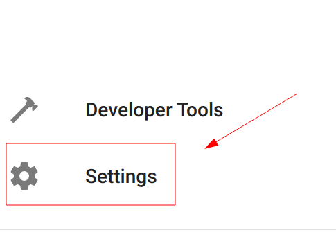
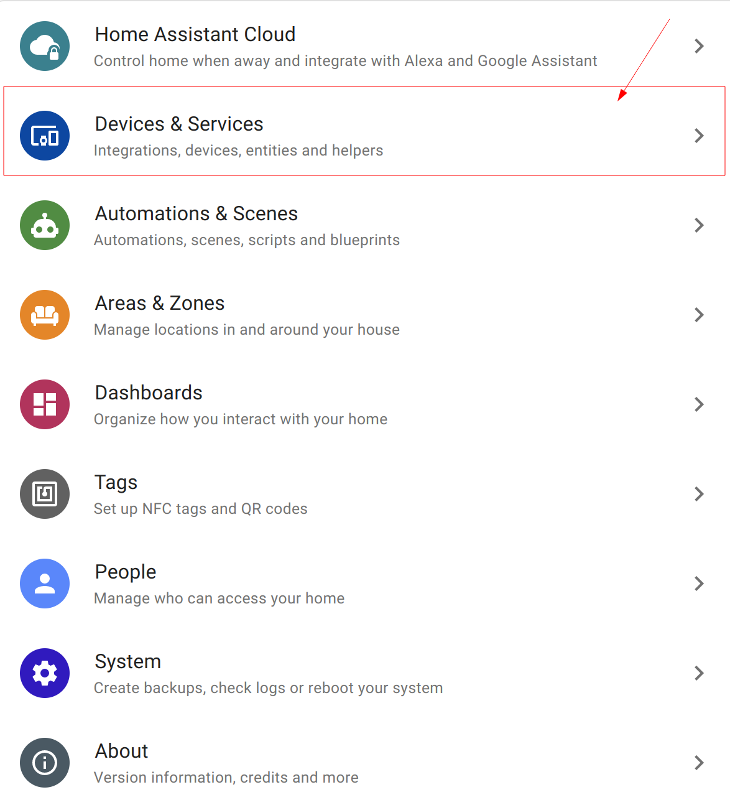
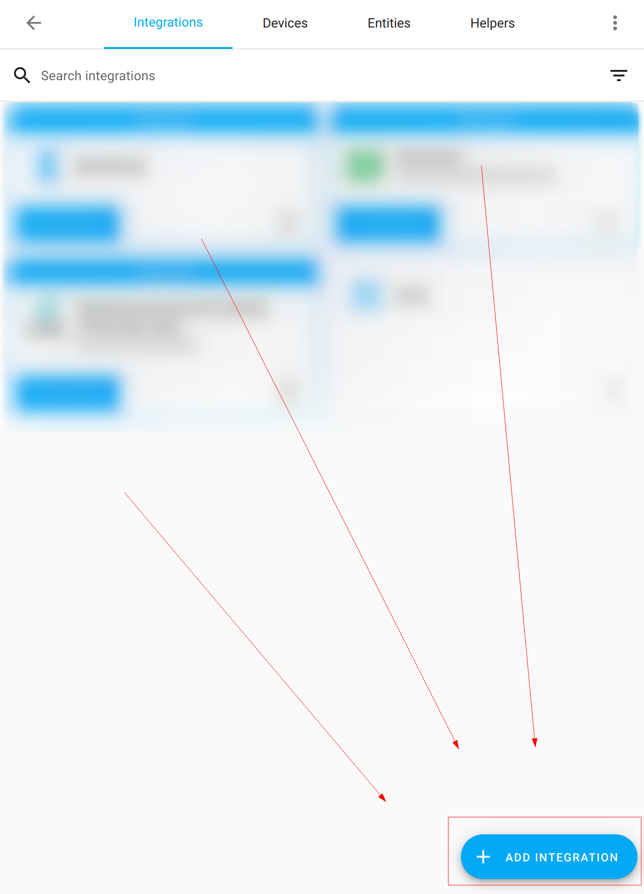
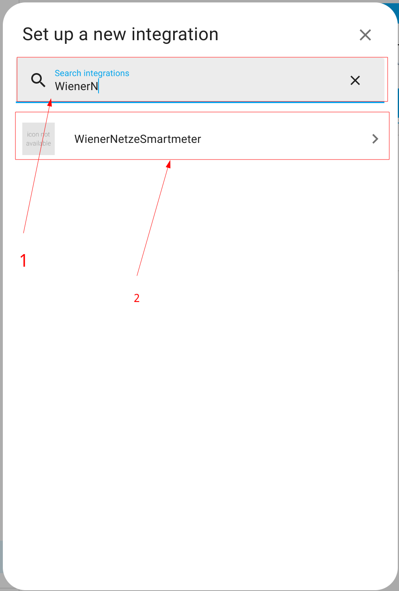
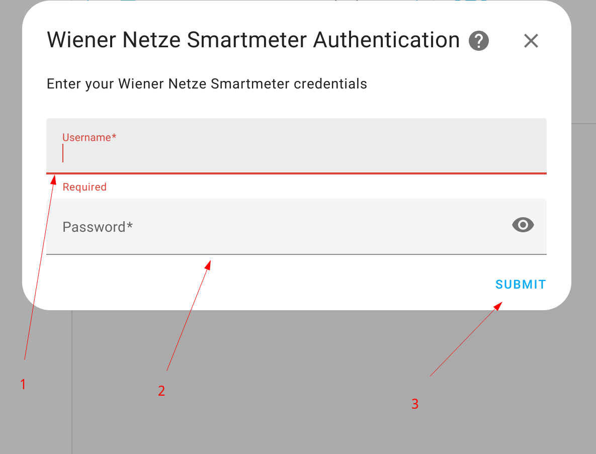
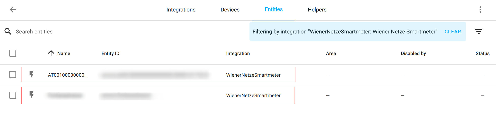

# Wiener Netze Smartmeter Integration for Home Assistant

## About 

This repo contains a custom component for [Home Assistant](https://www.home-assistant.io) for exposing a sensor
providing information about a registered [WienerNetze Smartmeter](https://www.wienernetze.at/smartmeter).

## Installation

### Manual

Copy `<project-dir>/custom_components/wnsm` into `<home-assistant-root>/config/custom_components`

### HACS
> tbd: Set up brands and check configuration

## Configure

You can choose between ui configuration or manual (by adding your credentials to `configuration.yaml` and `secrets.yaml` resp.)
After successful configuration you can add sensors to your favourite dashboard, or even to your energy dashboard to track your total consumption.

### UI

### Manual
See [Example configuration files](https://github.com/DarwinsBuddy/WienerNetzeSmartmeter/example/configuration.yaml)
## Copyright

This integration uses the API of https://www.wienernetze.at/smartmeter
All rights regarding the API are reserved by [Wiener Netze](https://www.wienernetze.at/impressum)
