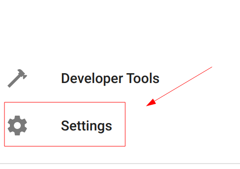
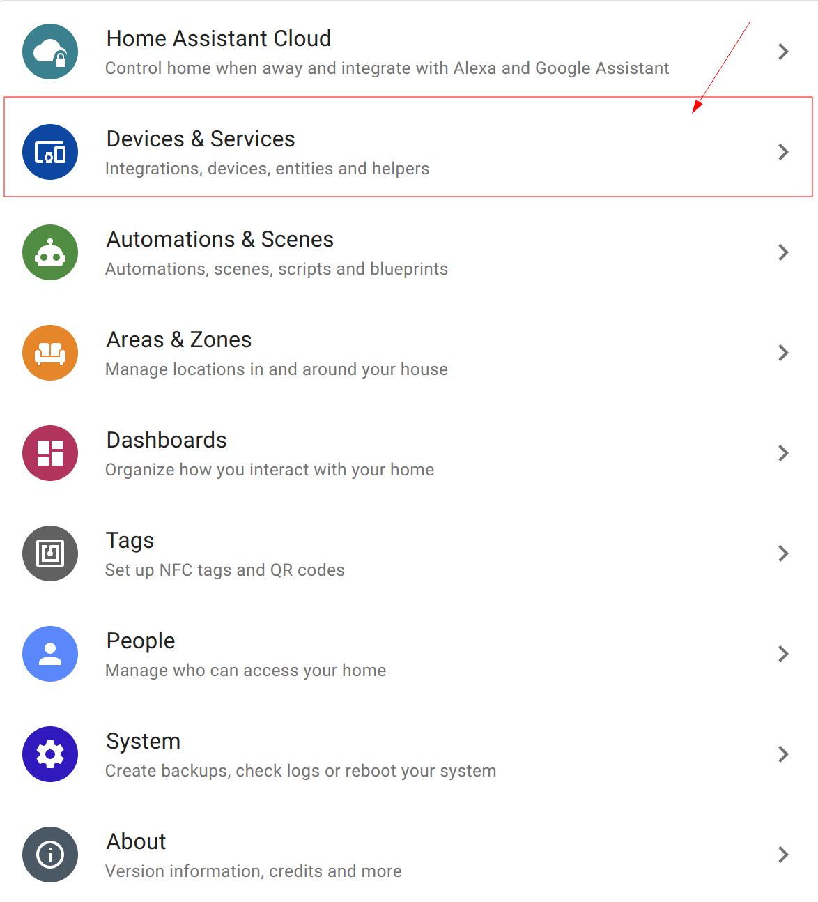
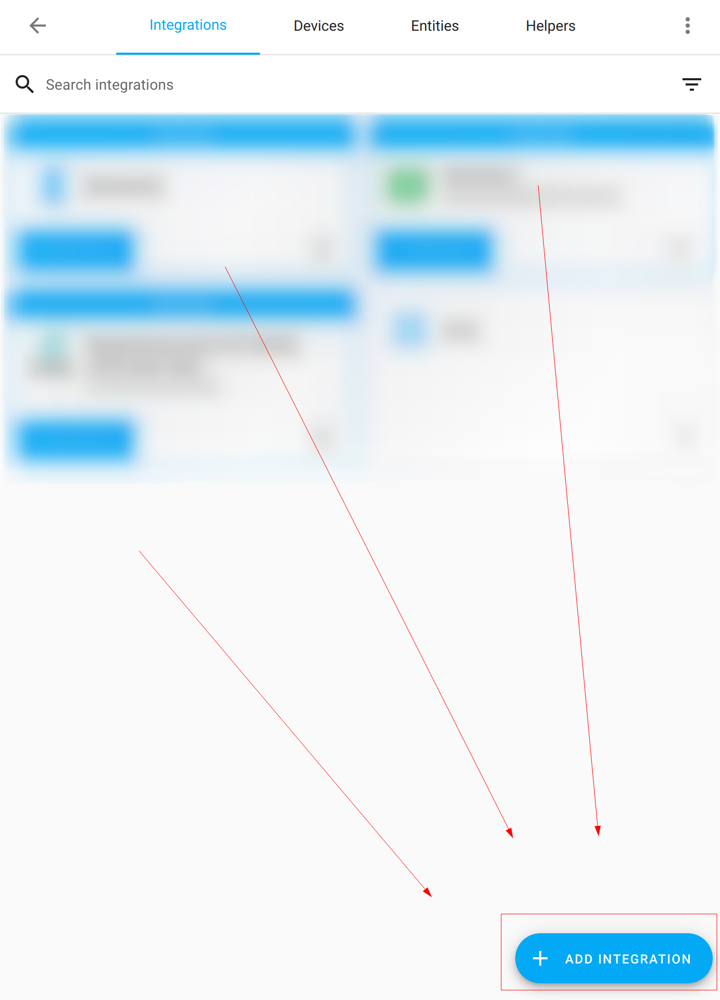
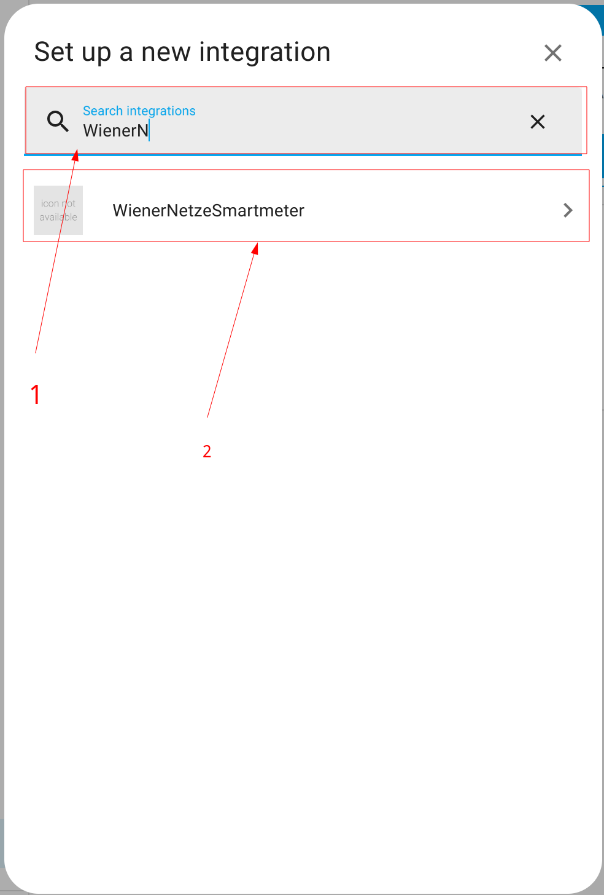
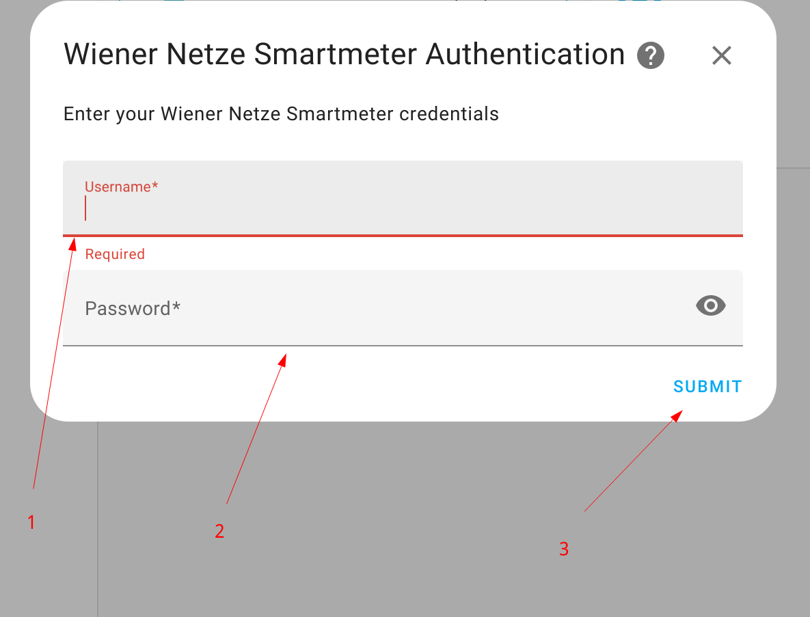
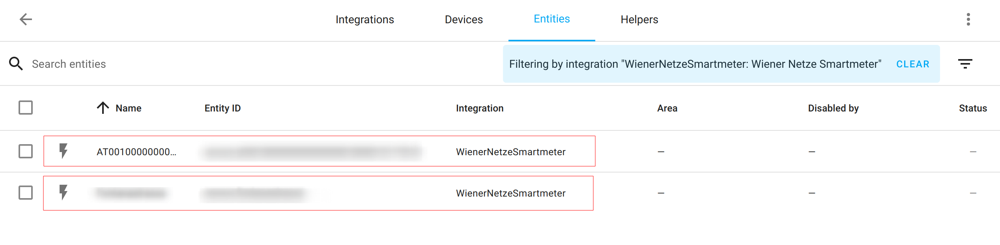

# Wiener Netze Smartmeter Integration for Home Assistant

## About 

This repo contains a custom component for [Home Assistant](https://www.home-assistant.io) for exposing a sensor
providing information about a registered [WienerNetze Smartmeter](https://www.wienernetze.at/smartmeter).

## Sensors

The integration exposes one main energy sensor per Zählpunkt (total increasing meter reading), an
additional main daily snapshot sensor (measurement-style, reading-date aligned), a daily
consumption sensor that reports the latest DAY value, a companion DAY reading-date timestamp sensor,
and a companion METER_READ reading-date timestamp sensor for clean UI display of effective dates.

Configuration options in the UI include scan interval (minutes) and an optional advanced DAY statistics import mode.

### Entity and statistics overview by Zählpunkt and Wertetyp

For each active **Zählpunkt**, the integration creates the following Home Assistant items:

| Area | Wertetyp source | What gets created | Value shown in HA | Unique/statistic ID pattern |
|---|---|---|---|---|
| Sensor entity | `METER_READ` | Main energy sensor | Latest meter reading (kWh), shown as total-increasing energy sensor | `unique_id: <zaehlpunkt>` |
| Sensor entity | `METER_READ` | Main daily snapshot sensor | Latest METER_READ value (kWh), measurement-style card value | `unique_id: <zaehlpunkt>_main_daily_snapshot` |
| Sensor entity | `DAY` | Daily consumption sensor | Latest daily consumption (kWh) | `unique_id: <zaehlpunkt>_day` |
| Sensor entity | `DAY` | DAY reading-date timestamp sensor | Source timestamp of the latest DAY value | `unique_id: <zaehlpunkt>_day_reading_date` |
| Sensor entity | `METER_READ` | METER_READ reading-date timestamp sensor | Effective reading date for the latest METER_READ value | `unique_id: <zaehlpunkt>_meter_read_reading_date` |
| Recorder statistics (long-term) | Main importer (`METER_READ`/default granularity path) | Long-term statistics series for the main sensor | Imported into recorder statistics for Energy/History usage, timestamped by the effective METER_READ reading date | `statistic_id: wnsm:<zaehlpunkt-lowercase>` |
| Recorder statistics (long-term) | `METER_READ` (snapshot) | Main daily snapshot long-term statistics series | Imported with `start == reading_date` (`state = meter_read_kWh`, `sum = None`) | `statistic_id: wnsm:<slugified-zaehlpunkt>_main_daily_snapshot_v2` |
| Recorder statistics (long-term, optional) | `DAY` | Additional DAY long-term statistics series (enabled via option) | One statistic point per day (`state = day kWh`, `sum = None`) | `statistic_id: wnsm:<slugified-zaehlpunkt>_day_v2` |

#### Important notes

- Enabling **DAY statistics import** does **not** create extra entities. It adds an extra recorder/long-term statistics series for DAY values.
- DAY and snapshot long-term statistics use versioned IDs (`_day_v2`, `_main_daily_snapshot_v2`) so new installs/upgrades get clean metadata without reusing stale recorder entries.
- With **2 Zählpunkte**, you will usually see **10 entities** (5 per Zählpunkt). If DAY stats import is enabled, you also get **2 extra long-term statistics series** (one per Zählpunkt) in addition to the main and main-snapshot statistics series.

## FAQs
[FAQs](https://github.com/DarwinsBuddy/WienerNetzeSmartmeter/discussions/19)

## Installation

### Manual

Copy `<project-dir>/custom_components/wnsm` into `<home-assistant-root>/config/custom_components`

### HACS
1. Search for `Wiener Netze Smart Meter` or `wnsm` in HACS
2. Install
3. ...
4. Profit!

## Configuration

Configure the integration via the Home Assistant UI and select your Zählpunkte during setup.

### Setup behavior (current implementation)

- The integration creates **5 entities per active Zählpunkt**:
  1. Main energy sensor (`METER_READ`, total increasing)
  2. Main daily snapshot sensor (`METER_READ`, measurement)
  3. Daily consumption sensor (`DAY`, measurement)
  4. DAY reading-date timestamp sensor
  5. METER_READ reading-date timestamp sensor
- With 2 Zählpunkte, this results in **10 entities**.

### Options

- **Scan interval (minutes):** polling interval for sensor updates.
- **Enable DAY statistics import to long-term recorder:** enabled by default.  
  When enabled, the integration imports an additional DAY long-term statistics series (`wnsm:<slugified-zaehlpunkt>_day_v2`).

### Long-term statistics and Energy Dashboard

- Main sensor long-term statistics (`wnsm:<zaehlpunkt-lowercase>`) are imported using the effective `METER_READ` reading date timestamp.
- DAY long-term statistics are optional and imported as daily points (`state=day kWh`, `sum=None`).
- Use the main sensor/statistics for cumulative energy tracking, and DAY for day-level comparison.

### UI

## Copyright

This integration uses the API of https://www.wienernetze.at/smartmeter
All rights regarding the API are reserved by [Wiener Netze](https://www.wienernetze.at/impressum)

Special thanks to [platrysma](https://github.com/platysma)
for providing me a starting point [vienna-smartmeter](https://github.com/platysma/vienna-smartmeter)
and especially [florianL21](https://github.com/florianL21/)
for his [fork](https://github.com/florianL21/vienna-smartmeter/network)
